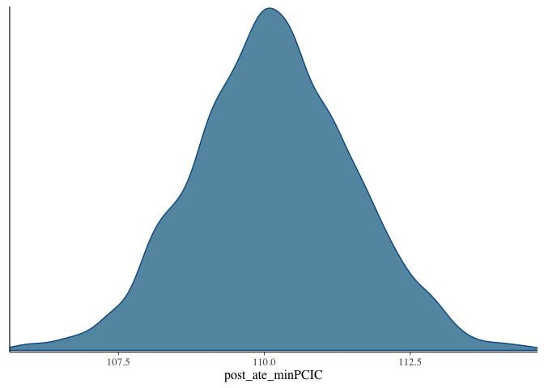
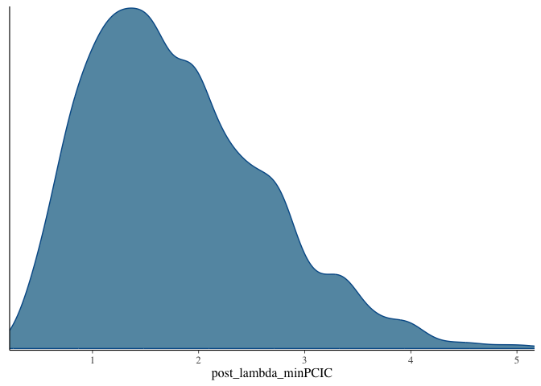

One-shot simulation study for BRCAL
================

## Setup `CmdStan`

``` r
install.packages("cmdstanr")
install_cmdstan()
```

## Load packages and defined function

``` r
library(bayesplot)
source("BRCAL-function.R")
PS <- function(LC) (1+exp(-LC))^(-1)
```

## Setting

``` r
set.seed(1)
n <- 1000  # sample size
p <- 4     # No. covariates in Propensity Score model
```

## Data generating process

true propensity score model $= {\rm expit}(X1 - 0.5X2 + 0.25X3 + 0.1X4)$

``` r
X <- matrix( rnorm(n*p), n, p )                                             # Confounders
t_ps <- drop(PS( tcrossprod(c(1,-0.5,0.25,0.1),X) ))                        # true PS
A <- rbinom(n,size=1,prob=t_ps)                                             # Exposure
t_IPW <- A/t_ps + (1-A)/(1-t_ps)                                            # true IPW
Y0 <- drop( tcrossprod(c(27.4,13.7,13.7,13.7),X) ) + rnorm(n)               # potential outcome if unexposured
Y1 <- drop( tcrossprod(c(110,27.4,13.7,13.7,13.7),cbind(1,X)) ) + rnorm(n)  # potential outcome if exposured
Y <- A*Y1 + (1-A)*Y0                                                        # Outcome
```

Suppose we can specify the propensity score model.

``` r
W <- X
```

## Implementation of BRCAL with some learning rates

``` r
omega.seq <- c(0.2,0.5,1.0,1.5)  # candidates of learning rates
nomega <- length(omega.seq)

post_ate <- matrix(NA,4000,nomega)
post_lambda <- matrix(NA,4000,nomega)
PCIC <- rep(NA,nomega)
for (no in 1:nomega) {
  post <- BRCAL(Y=Y, A=A, X=W, weight=omega.seq[no])
  post_ate[,no] <- post$post_ate_brcal
  post_lambda[,no] <- post$post_lambda
  PCIC[no] <- post$PCIC
}
```

We choose the posterior draws for learning rate, which minimize the PCIC

``` r
post_ate_minPCIC <- post_ate[,which.min(PCIC)]
post_lambda_minPCIC <- post_lambda[,which.min(PCIC)]
```

## Summary

``` r
mean(post_ate_minPCIC)                                # posterior mean
```

    ## [1] 110.1539

``` r
quantile(post_ate_minPCIC, probs=c(0.025,0.5,0.975))  # posterior median and 95% credible interval
```

    ##     2.5%      50%    97.5% 
    ## 107.4517 110.1309 112.8804

We plot the posterior of ATE and a specified upper bound for covariate
balance.

``` r
bayesplot::mcmc_dens(as.data.frame(post_ate_minPCIC))
```

<!-- -->

``` r
bayesplot::mcmc_dens(as.data.frame(post_lambda_minPCIC))
```

<!-- -->
